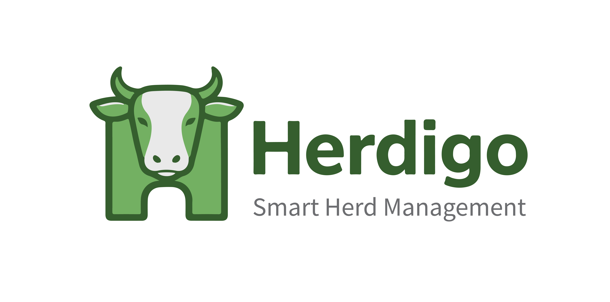

<div align="center">



# Herdigo
### Smart Herd Management

<br/>


<br/>

> **Herdigo helps farmers manage livestock efficiently through modern digital tools.**  
> *Simple, reliable, and smart herd management.*

---

</div>

## 🌿 What is Herdigo?

Herdigo is a modern **livestock management platform** designed to help farmers efficiently track, manage, and optimize herd operations. We digitize traditional farm record keeping and provide a centralized system for managing livestock data — from health records and breeding cycles to vaccinations and herd productivity.

---

## 🧩 Core Modules

| Module | Description |
|---|---|
| 👤 **User Management** | Authentication, role-based access, farmer profiles |
| 🐄 **Herd Management** | Register livestock, assign IDs, track herd size |
| 🏥 **Health Management** | Vaccination records, disease history, vet visits |
| 🔁 **Breeding Management** | Mating records, pregnancy tracking, birth registration |
| 🔔 **Notifications** | Vaccination reminders, health check alerts |
| 📊 **Analytics & Reporting** | Herd growth stats, health reports, productivity insights |

---

## ⚙️ Technology Stack

<table>
<tr>
<td><strong>Frontend</strong></td>
<td>Next.js · React · TailwindCSS · REST API</td>
</tr>
<tr>
<td><strong>Backend</strong></td>
<td>Spring Boot · Microservices · Spring Security</td>
</tr>
<tr>
<td><strong>Database</strong></td>
<td>PostgreSQL</td>
</tr>
</table>

---

## 🏗️ System Architecture

Herdigo follows a **microservice-based architecture** where the Next.js frontend communicates with dedicated Spring Boot services through RESTful APIs.

```
┌─────────────────────┐
│   Next.js Frontend  │
└────────┬────────────┘
         │ REST API
┌────────▼────────────────────────────────┐
│           Spring Boot Microservices     │
│  ┌──────────┐ ┌──────────┐ ┌─────────┐ │
│  │   User   │ │   Herd   │ │ Health  │ │
│  │ Service  │ │ Service  │ │ Service │ │
│  └──────────┘ └──────────┘ └─────────┘ │
└────────────────────────┬────────────────┘
                         │
               ┌─────────▼──────────┐
               │     PostgreSQL      │
               └────────────────────┘
```

---

## ✨ Key Benefits

- 📋 Reduces manual record keeping
- 🏥 Improves livestock health tracking
- 📈 Helps farmers make better decisions
- 🚜 Increases farm productivity
- 🗂️ Provides centralized livestock data

---

## 🚀 Future Enhancements

- 📱 Mobile application
- 🤖 AI-based livestock health prediction
- 📡 IoT integration for smart farm sensors
- 🥛 Milk production tracking
- 🛒 Livestock marketplace integration

---

<div align="center">

<br/>

*Track your herd easily. Manage livestock smarter.*  
*Healthy herds start with better management.*

<br/>


</div>